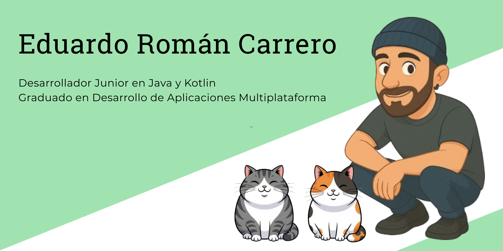

  

<h1 align="center">👋 ¡Hola! Soy Eduardo Román Carrero</h1>

Desarrollador junior en Java y Kotlin graduado en Desarrollo de Aplicaciones Multiplataforma. 

---

### 🚀 En qué estoy trabajando

Actualmente sigo ampliando mis habilidades como desarrollador backend con Java y Kotlin.  
Aquí iré subiendo proyectos propios y ejemplos que demuestran lo que sé hacer y lo que voy aprendiendo.

---

### 🧰 Tecnologías y herramientas

- Java · Kotlin · JUnit · Mockito  
- Git · GitHub · Scrum · POO  
- SQL · Testing · Arquitectura modular · Ciberseguridad

---

### 💡 Sobre mí

Antes de dedicarme a la programación, he trabajado en entornos donde la organización, la renovación continua y la comunicación eran clave: coordinación de instalaciones deportivas, el mundo de la montaña y el ámbito de la comunicación y el periodismo.

Esto me ha enseñado a ser autodidacta, trabajar con autonomía y mantener siempre un alto nivel de compromiso. Ya sea en equipo o en remoto, me esfuerzo por sumar y cuidar el ambiente de trabajo.

---

### 📂 Algunos proyectos destacados

### 📂 Algunos proyectos destacados

- 🗓️ [`Tasks for Today`](https://github.com/eduroman87/tasks4today/) — Aplicación Android para **gestión de tareas diarias**, con categorías, prioridades y panel de estadísticas. Desarrollada en **Kotlin**, usando **Firebase Realtime Database** para almacenamiento y **Firebase Authentication** para usuarios. Arquitectura modular basada en **POO** y diseño en **XML + Material Design**.  
- 🍅 [`PomodoroJC`](https://github.com/eduroman87/pomodoroJC-JetpackCompose-) — Aplicación Android basada en la técnica Pomodoro, desarrollada con **Kotlin**, **Jetpack Compose**, **corrutinas** y arquitectura **MVVM** para practicar retos de desarrollo.

> *Iré subiendo más proyectos a medida que avanzo. ¡Esto no ha hecho más que empezar!*

---

### 🙋‍♂️ Un poco más sobre mí

🔭 Actualmente estoy desarrollando proyectos personales con Java y Kotlin.  
🌱 Aprendiendo más sobre testing, Spring Boot y herramientas modernas.  
💬 Pregúntame sobre desarrollo backend o cómo reinventarte en el mundo tech.  
📫 Estoy en [LinkedIn](www.linkedin.com/in/eduardoromancarrero), ¡conectemos!  

---

